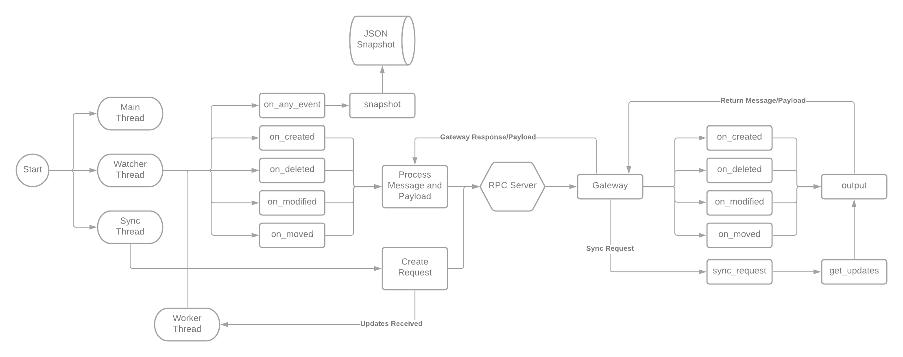

# PySync

## Oficial Repository

[PySync](https://github.com/IsraelPinheiro/pySync)

## Development Team

- [Israel Pinheiro](https://github.com/IsraelPinheiro)
- [Ricássio Costa](https://github.com/ricassiocosta)
- [Lucas Gomes](https://github.com/olucasgomes)

## What is PySync?

PySync is a file synchronization system written in python, as evaluative work for the Distributed Systems course. The goal of the project was to develop a small file server, using different distributed development methodologies.

## Methodology

The project was developed in 4 different stages, so that each stage was an evolution of the previous one. The stages were: </br>
1 - Establish communication between client and server using API sockets - DONE</br>
2 - To evolve this communication to use RPC - DONE </br>
3 - Implement mechanisms of synchronization and mutual exclusion - DONE </br>
4 - Implement data replication mechanisms - WORK IN PROGRESS

## How PySync works?

PySync uses a client-server architecture and works in such a way that, the client is always observing if there are any changes in the folder in which you want to synchronize, if there are changes, the client sends the information to the server, which has a copy of all synchronized files, and replicates the change reported by the client.

## PySync Client (Agent)

The strategy used to implement PySync Agent was to use a thread to monitor all the files in the folder at all times and record in a json file the name and date of the last modification of each file. This way, whenever a new file is added to the folder, the thread detects that file and adds its information inside json, the same way when a file is modified/deleted, the information is updated/deleted from inside json. </br>
PySync Agent has a watchdog that monitors all file system events, as even a modification is detected as a deletion followed by a creation, only the on_created and on_deleted methods of the watchdogs have been implemented so that when a new file is added to the folder, a request (defined below) is mounted and sent to the server. In this request is informed things like the action that the Agent is reporting (Create/Delete), the timestamp of the action, the information of the Agent and the file in question, which are basically the information of name and size of the file. This request is sent with a payload that is composed with the binary of the file in question. Likewise, when a file is deleted, the watchdog will intercept the event and will assemble a request that will inform almost the same information as the creation request, but only with the name of the file to be deleted.

## PySync Server

On the server side, all messages sent by the client are received by a gateway, which segments the messages according to the type of action of the received message. If it is a creation of a new file, the server will store the information of the file and the Agent that sent it in the database and will store the sent file in a local folder. Similarly, when there is a file deletion event, the server will remove this information from the database and delete the file from the local folder.

## What is missing and improvement points

<ul>
    <li>
        To date PySync does not have an authentication system that guarantees unique identification of each Agent.
    </li>
    <li>
        Multiple Agent synchronization functionality is not yet implemented
    </li>
    <li>
        Synchronization of files with new Agents not yet implemented
    </li>
</ul>

## PySync Diagram

The following diagram abstracts the communication flow between the Agent and the Server:
<br>

## Message Transfer Protocol

### Register Agent

- Client Request

```jsonc
{
  "Action": "RegisterAgent",
  "Timestamp": 1604061231.0383,
  "Agent": {
    "Key": "6C19A781148814833ED25840B7A07BA7",
    "User": {
      "Email": "usuario01@pysync.com",
      "Password": "D1A5FF8DBEEDAA3406368724EBBD3CB0" //Password MD5 Hash
    }
  }
}
```

- Possible Server Responses

```jsonc
{
  "Action": "ServerResponse",
  "Timestamp": 1604061231.0383,
  "Status": 200
},
{
  "Action": "ServerResponse",
  "Timestamp": 1604061231.0383,
  "Status": 400
},
{
  "Action": "ServerResponse",
  "Timestamp": 1604061231.0383,
  "Status": 500
}
```

### Register User

- Client Request

```jsonc
{
  "Action": "RegisterUser",
  "Timestamp": 1604061231.0383,
  "Agent": {
    "Key": "6C19A781148814833ED25840B7A07BA7",
    "User": {
      "Email": "usuario01@pysync.com",
      "Password": "D1A5FF8DBEEDAA3406368724EBBD3CB0" //Password MD5 Hash
    }
  }
}
```

- Possible Server Responses

```jsonc
{
  "Action": "ServerResponse",
  "Timestamp": 1604061231.0383,
  "Status": 200
},
{
  "Action": "ServerResponse",
  "Timestamp": 1604061231.0383,
  "Status": 400
},
{
  "Action": "ServerResponse",
  "Timestamp": 1604061231.0383,
  "Status": 500
}
```

### New File

- Client Request

```jsonc
{
  "Action": "Create",
  "Timestamp": 1604061231.0383,
  "Agent": {
    "Key": "6C19A781148814833ED25840B7A07BA7",
    "User": {
      "Email": "usuario01@pysync.com",
      "Password": "D1A5FF8DBEEDAA3406368724EBBD3CB0" //Password MD5 Hash
    }
  },
  "File": {
    "OriginalName": "Arquivo01.txt",
    "Size": "32253" //Size, in bytes, of the file
  }
}
```

- Possible Server Responses

```jsonc
{
  "Action": "ServerResponse",
  "Timestamp": 1604061231.0383,
  "Status": 200
},
{
  "Action": "ServerResponse",
  "Timestamp": 1604061231.0383,
  "Status": 100
},
{
  "Action": "ServerResponse",
  "Timestamp": 1604061231.0383,
  "Status": 400
},
{
  "Action": "ServerResponse",
  "Timestamp": 1604061231.0383,
  "Status": 403
}
```

### Open File

- Client Request

```jsonc
{
  "Action": "Open",
  "Timestamp": 1604061231.0383,
  "Agent": {
    "Key": "6C19A781148814833ED25840B7A07BA7",
    "User": {
      "Email": "usuario01@pysync.com",
      "Password": "D1A5FF8DBEEDAA3406368724EBBD3CB0" //Password MD5 Hash
    }
  },
  "File": {
    "Name": "Arquivo01.txt"
  }
}
```

- Possible Server Responses

```jsonc
{
  "Action": "ServerResponse",
  "Timestamp": 1604061231.0383,
  "Status": 200
},
{
  "Action": "ServerResponse",
  "Timestamp": 1604061231.0383,
  "Status": 400
},
{
  "Action": "ServerResponse",
  "Timestamp": 1604061231.0383,
  "Status": 403
},
{
  "Action": "ServerResponse",
  "Timestamp": 1604061231.0383,
  "Status": 404
}
```

### Update File

- Client Request

```jsonc
{
  "Action": "Update",
  "Timestamp": 1604061231.0383,
  "Agent": {
    "Key": "6C19A781148814833ED25840B7A07BA7",
    "User": {
      "Email": "usuario01@pysync.com",
      "Password": "D1A5FF8DBEEDAA3406368724EBBD3CB0" //Password MD5 Hash
    }
  },
  "File": {
    "Name": "BBE02F946D5455D74616FC9777557C22",
    "Size": "32253" //Size, in bytes, of the file
  }
}
```

- Possible Server Responses

```jsonc
{
    "Action":"ServerResponse",
    "Timestamp":1604061231.0383,
    "Status":200 //OK - File Updated
}
{
    "Action":"ServerResponse",
    "Timestamp":1604061231.0383,
    "Status":100 //Continue - Server ready to receive the file
},
{
    "Action":"ServerResponse",
    "Timestamp":1604061231.0383,
    "Status":400 //Bad Request - Outside the expected format for the type of action
},
{
    "Action":"ServerResponse",
    "Timestamp":1604061231.0383,
    "Status":403 //Denied - Unauthorized User or Agent
},
{
    "Action":"ServerResponse",
    "Timestamp":1604061231.0383,
    "Status":404 //Not Found - Arquivo não localizado
}
```

### Delete File

- Client Request

```jsonc
{
  "Action": "Delete",
  "Timestamp": 1604061231.0383,
  "Agent": {
    "Key": "6C19A781148814833ED25840B7A07BA7",
    "User": {
      "Email": "usuario01@pysync.com",
      "Password": "D1A5FF8DBEEDAA3406368724EBBD3CB0" //Password MD5 Hash
    }
  },
  "File": "BBE02F946D5455D74616FC9777557C22"
}
```

- Possible Server Responses

```jsonc
{
  "Action": "ServerResponse",
  "Timestamp": 1604061231.0383,
  "Status": 200
},
{
  "Action": "ServerResponse",
  "Timestamp": 1604061231.0383,
  "Status": 100
},
{
  "Action": "ServerResponse",
  "Timestamp": 1604061231.0383,
  "Status": 400
},
{
  "Action": "ServerResponse",
  "Timestamp": 1604061231.0383,
  "Status": 403
},
{
  "Action": "ServerResponse",
  "Timestamp": 1604061231.0383,
  "Status": 404
}
```

### Synchronization with Remote Server

- Client Request

```jsonc
{
  "Action": "Sync",
  "Timestamp": 1604061231.0383,
  "Agent": {
    "Key": "6C19A781148814833ED25840B7A07BA7",
    "User": {
      "Email": "usuario01@pysync.com",
      "Password": "D1A5FF8DBEEDAA3406368724EBBD3CB0" //Password MD5 Hash
    }
  }
}
```

- Possible Server Responses

```jsonc
{
  "Action": "ServerResponse",
  "Timestamp": 1604061231.0383,
  "Status": 200,
  "Changes": {
    "Created": [
      {
        "OriginalName": "Arquivo01.txt",
        "Size": "32253"
      },
      {
        "OriginalName": "Arquivo02.txt",
        "Size": "32253"
      }
    ],
    "Updated": [
      {
        "OriginalName": "Arquivo03.txt",
        "Size": "32253"
      },
      {
        "OriginalName": "Arquivo04.txt",
        "Size": "32253"
      }
    ],
    "Deleted": [
      {
        "OriginalName": "Arquivo05.txt",
        "Size": "32253"
      },
      {
        "OriginalName": "Arquivo06.txt",
        "Size": "32253"
      }
    ]
  }
},
{
  "Action": "ServerResponse",
  "Timestamp": 1604061231.0383,
  "Status": 400
},
{
  "Action": "ServerResponse",
  "Timestamp": 1604061231.0383,
  "Status": 403
}
```
